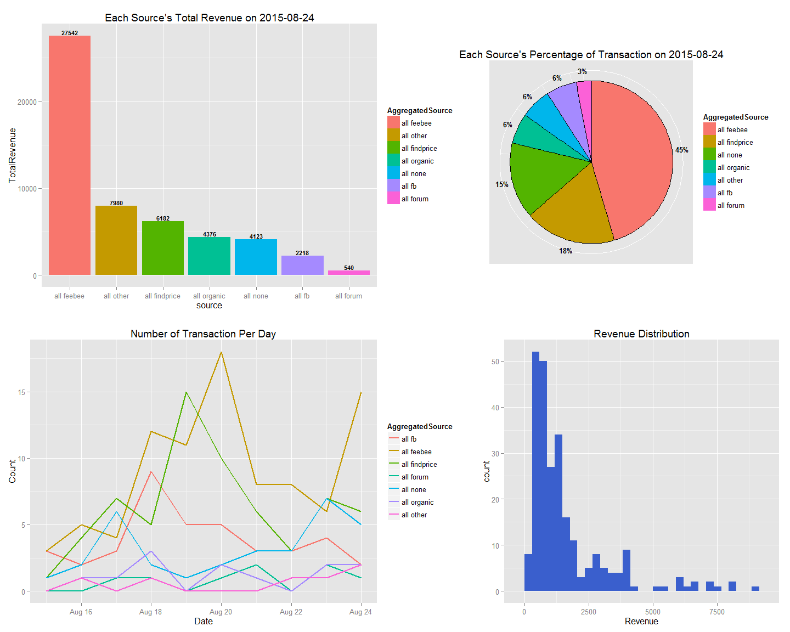

# Google Analytics Project1
Ethen Liu  
2015/8/25  

## I. Environment Setting

Setting includes, load in the required libraries, clean up the global environment, set the local time to English ( this will prevent dates from printing out in Chinese ) and set the working directory.


```r
library(grid)
library(tidyr)
library(ggplot2)
library(gridExtra)
suppressMessages( library(dplyr) )
suppressWarnings( library(stringr) )
suppressMessages( library(data.table) )

rm( list = ls() )
Sys.setlocale( "LC_TIME", "English" )
setwd("C:/Users/ASUS/Ecommerce/GoogleAnalytics1")
```

## II. Data Preprocessing


```r
# base data Analytics.csv
data <- data.table( read.csv( "data/Analytics.csv", stringsAsFactors = FALSE ) )
head( data, 3 )
```

```
##         TransactionCode                 MediaSource Revenue Tax
## 1: ON700381508185801258            google / organic    8926  10
## 2: ON400781508198401403 findprice.com.tw / referral    7998  10
## 3: ON100011508167701056 findprice.com.tw / referral    6190  10
##    ShippingFee Refund Amount
## 1:         400      0      3
## 2:           0      0      2
## 3:           0      0      1
```


Read in the new dataset downloaded from Google Analytics( .csv version ). In this case, it is the file "Analytics 20150819-20150824.csv" in the folder, note that the file.choose function enables the dataset to be anywhere in your computer. You're free to download the new dataset from Google Analytics to any place you want in your computer as long as you can find it. Also note that, after all the necessary tasks are done, the new dataset will be appended to the base dataset "Analytics.csv", which means you can delete the new dataset afterwards. The preprocessing steps required for the csv file is elaborated below.

- The first 9 rows are meaningless, they're simply gibberish when downloaded from Google Analytics.
- The csv file does not contain the header, rename them manually using the names of the base data. 
- All blank lines are seen as NA value, and rows that contains NA values are removed after you've finished reading the new dataset.


```r
newdata <- data.table( read.csv( file.choose(), stringsAsFactors = FALSE, 
                                 na.strings = "", skip = 9, header = FALSE ) )
newdata <- newdata[ complete.cases(newdata), ]
setnames( newdata, names(data) )
head( newdata, 3 )
```

```
##         TransactionCode                      MediaSource     Revenue
## 1: ON300341508243501760         feebee.com.tw / referral NT$7,980.00
## 2: ON200781508236601724      findprice.com.tw / referral NT$7,399.00
## 3: ON500761508234301722 nccnet-ec.nccc.com.tw / referral NT$7,188.00
##         Tax ShippingFee  Refund Amount
## 1: NT$10.00     NT$0.00 NT$0.00      2
## 2: NT$10.00     NT$0.00 NT$0.00      1
## 3: NT$10.00     NT$0.00 NT$0.00      1
```

- **Note:** From the partial printed data above, four columns, including Revenue, Tax, ShippingFee and Refund contains symbols, punctuation marks and therefore can't be directly converted to numeric values as they should be. So we'll next handle this issue.

#### Preprocessing Steps

- **Step1:** `preprocess` Define a function. Given the specified column of the dataset, first extract all the numeric digits and convert the string to numeric value. A caution worth noticing is the fact that numbers starting from 1,000 contains a comma to seperate the last three values, remember to exclude that as well. There might be a better way to do this, so I'm open to different solutions. Now, we're good to go! Select the columns from the newdata that requires this preprocessing step, and use the preprocess function on all of them. 


```r
preprocess <- function(x)
{
    string <- str_extract( x, "([:digit:]+\\,)*([:digit:]+)" )
    as.numeric( gsub( "\\,", "", string ) )
}

columns <- which ( names(data) %in% c( "Revenue", "Tax", "ShippingFee", "Refund" ) )
newdata <- newdata %>% 
           modifyList( lapply( newdata[ , columns, with = FALSE ], preprocess ) )
head( newdata, 3 )
```

```
##         TransactionCode                      MediaSource Revenue Tax
## 1: ON300341508243501760         feebee.com.tw / referral    7980  10
## 2: ON200781508236601724      findprice.com.tw / referral    7399  10
## 3: ON500761508234301722 nccnet-ec.nccc.com.tw / referral    7188  10
##    ShippingFee Refund Amount
## 1:           0      0      2
## 2:           0      0      1
## 3:           0      0      1
```

- **Note:** After confirming that the former preprocessing step worked out just like we want it to. Move on to the next step.

- **Step2:** `data` Combine the new and original dataset, and use the unique function to prevent accidently loading in data of the same day.

- **Step3:** Extract date from the TransactionCode column and add a new Date column to the data. The pattern is ON, followed by 5 random digits from 0 to 9, then the after is the five digits that is the recorded date in which that transaction occured. 


```r
data <- unique( rbind( data, newdata ) )

date <- gsub( "ON[0-9]{5}([0-9]{6}).*", "20\\1", data$TransactionCode )
data$Date <- as.Date( date, format = "%Y%m%d" )
```

The next section of the preprocessing is to categorize the MediaSource into user-defined category for aggregated source's exploratory data analysis. The category is pre-defined in the "sourcecategory.csv" file that is placed in the "code" file. The way for doing it is sort of like the VLOOKUP function in excel.


```r
sourcecategory <- read.csv( "code/sourcecategory.csv", stringsAsFactors = FALSE )
# remove possible whitespace in the beginning and end of source before matching 
data$AggregatedSource <- sourcecategory$aggregatecategory[ match(data$MediaSource,
                                                    str_trim(sourcecategory$sources) ) ]
# all the ones that are not matched are categorized as all other
data$AggregatedSource[ is.na(data$AggregatedSource) ] <- "all other"
```

- **Note:** After all the necessary preprocessing are done, we now have the tidy version of the data to work with.

## III. Exploratory Data Analysis

This part generates four visualizations.

1. `transactionperday` Line graph : Count the number of transactions from each aggregated sources for each day.

2. `lastestrevenue` Bar plot : Total revenue that was generated from each aggregated sources of the most present date. 

3. `revenuedistribution` Histogram : Distribution of how much revenue does each transaction generate.

4. `transactionpercentage` Pie chart : Percentage of transactions from each aggregated sources of the most present date, . 


```r
# Visualization 1
# use table so that days that have zero transcation will also show up 
countSource <- data.table( with( data, table( Date, AggregatedSource ) ) )
setnames( countSource, "N", "Count" )

# have to convert the Date column to date once again
countSource$Date <- as.Date( countSource$Date, format = "%Y-%m-%d" )

transactionperday <- ggplot( countSource, aes( Date, Count, color = AggregatedSource ) ) +
                     geom_line( size = 1 ) +
		             ggtitle( "Number of Transaction Per Day" )
```


```r
# Visualization 2
# latest date ( most present )
latestdate <- unique(data$Date)[ order( unique(data$Date), decreasing = TRUE ) ][1]

data$Revenue <- as.numeric(data$Revenue)
revenuedata  <- data[ data$Date == latestdate, .( TotalRevenue = sum(Revenue) ), by = list(AggregatedSource) ] %>%
                arrange( desc(TotalRevenue) )

lastestrevenue <- ggplot( revenuedata, aes( x = reorder( AggregatedSource, -TotalRevenue ),
                                            y = TotalRevenue, fill = AggregatedSource ) ) +
                  geom_bar( stat = "identity" ) + 
	              geom_text( aes( label = TotalRevenue ), vjust = -.2, size = 3, fontface = "bold" ) +
                  scale_fill_discrete( limits = revenuedata$AggregatedSource ) +
	              labs( title = sprintf( "Each Source's Total Revenue on %s", latestdate ), 
	                    x = "source" )
```


```r
# Visualization 3 
revenuedistribution <- ggplot( data, aes(Revenue) ) + 
                       geom_histogram( fill = "royalblue3" ) + 
					   ggtitle( "Revenue Distribution" )
```


```r
# Visualization 4 
sourcesdata <- data[ data$Date == latestdate, .( Source = .N ), 
                     by = list(AggregatedSource) ] %>% 
		       arrange( desc(Source) )

breaks <- with( sourcesdata, cumsum(Source) - Source/2 )
labels <- round( with( sourcesdata, Source/sum(Source) ), 2 ) * 100

transactionpercentage <- ggplot( sourcesdata, aes( 1, Source, fill = AggregatedSource ) ) + 
						 geom_bar( stat = "identity", color = "black" ) +
						 guides( fill = guide_legend( override.aes = list( colour = NA ) ) ) + 
                         coord_polar("y") +
						 scale_y_continuous( breaks = breaks, labels = paste0( as.character(labels), "%" ) ) +
						 ggtitle( sprintf( "Each Source's Percentage of Transaction on %s", latestdate ) ) +
                         scale_fill_discrete( limits = sourcesdata$AggregatedSource ) +
						 theme( axis.title  = element_blank(),
						        axis.ticks  = element_blank(), 
						        axis.text.y = element_blank(), 
						        axis.text.x = element_text( color = "black", face = "bold" ) ) 
```


```r
# print the plot 
define_region <- function( row, col )
{
    viewport( layout.pos.row = row, layout.pos.col = col )
} 
# Open a new page on grid device
grid.newpage() 
# define the layout of the new grid
pushViewport( viewport( layout = grid.layout( 4, 5 ) ) )
# print each plot onto the grid with the specified row and col width
print( lastestrevenue       , vp = define_region( 1:2, 1:3 ) )
print( transactionpercentage, vp = define_region( 1:2, 4:5 ) )
print( transactionperday    , vp = define_region( 3:4, 1:3 ) )
print( revenuedistribution  , vp = define_region( 3:4, 4:5 ) )
```

 


```r
# ------------------------------------------------------------------------------------------
# write out files section

# write out the count the number of transaction from different sources in each day to excel file
# aggregated version
countSourceSpread <- spread( countSource, key = AggregatedSource, value = Count )
countSourceSpread$TotalTransaction <- rowSums( countSourceSpread[ , -1, with = FALSE ] )
write.csv( countSourceSpread, file = "data/aggregatedcategory.csv", row.names = FALSE )

#  non-aggregated version
data$Category <- sourcecategory$category[ match(data$MediaSource, str_trim(sourcecategory$sources) ) ]
# all the ones that are not matched are categorized as other
data$Category[ is.na(data$Category) ] <- "other"

countCategory <- data.table( with( data, table( Date, Category ) ) )
setnames( countCategory, "N", "Count" )

countCategorySpread <- spread( countCategory, key = Category, value = Count )
write.csv( countCategorySpread, file = "data/category.csv", row.names = FALSE )

# overide the base Analytics data, remember to exclude the added column
# Date, AggregatedSource, Category
write.csv( data %>% select( 1:7 ), file = "data/Analytics1.csv", row.names = FALSE )
```


